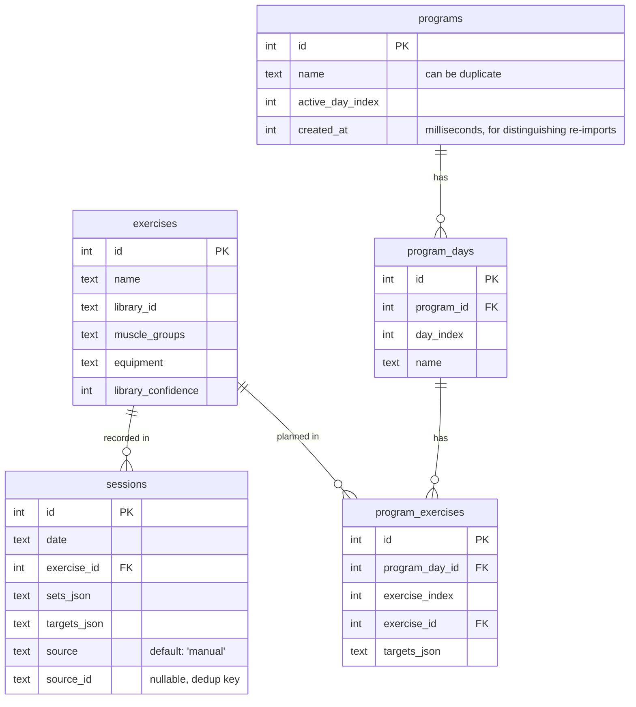

# Data model

> **State:** current as of v0.5 — includes import deduplication (source_id) and program timestamps.

## Tables

## Notes

**`exercises` is the canonical name registry and library bridge.** Both `sessions` and `program_exercises` reference `exercises.id` via foreign key. The table is enriched with metadata from the bundled `exercises.json` library (via `library_id`, `muscle_groups`, etc.) during app initialization. This enrichment is "lazy" and depends on an exact name match.

**Sessions and programs are still separate domains.**
 Sessions are immutable historical facts; programs are plans. A program change or deletion must not touch session rows. The shared FK into `exercises` is a naming contract, not a behavioural coupling.

**Same exercise across days.** If an exercise appears on multiple program days (e.g. Squat on Day 1 and Day 3), `program_exercises` has independent rows for each. Progression state will key on `exercise_id` so both days advance together — to be resolved when the progression engine is built.

**`sets_json` / `targets_json`** store arrays of `WorkingSet` / `Target` objects (see `src/types.ts`). Kept as JSON blobs to avoid a join-heavy schema while the shape is still evolving.

**Day-centric by design.** `program_days` has no week or block concept — just named days in order. This keeps the schema simple and accommodates programs from other sources that may not have a week structure.

**Import deduplication.** `sessions.source` and `sessions.source_id` enable idempotent imports:
- Imported sessions (source='liftosaur', 'strong', etc.) are deduplicated by `source_id` (the original system's ID).
- Manual sessions (source='manual', source_id=NULL) are never deduplicated (each log creates a new row).
- Unique constraint on (source, source_id) prevents duplicate imports. SQLite treats NULL as distinct, so manual sessions don't collide with each other.

**Program timestamps.** `programs.created_at` allows multiple programs with the same name to coexist without collision:
- When a program is imported, a new program row is created with the current timestamp.
- Re-importing the same file creates a fresh copy (not an update), preserving any in-app edits to the original.
- The UI can use `created_at` to show which version is newer, or to sort/deduplicate on display.
