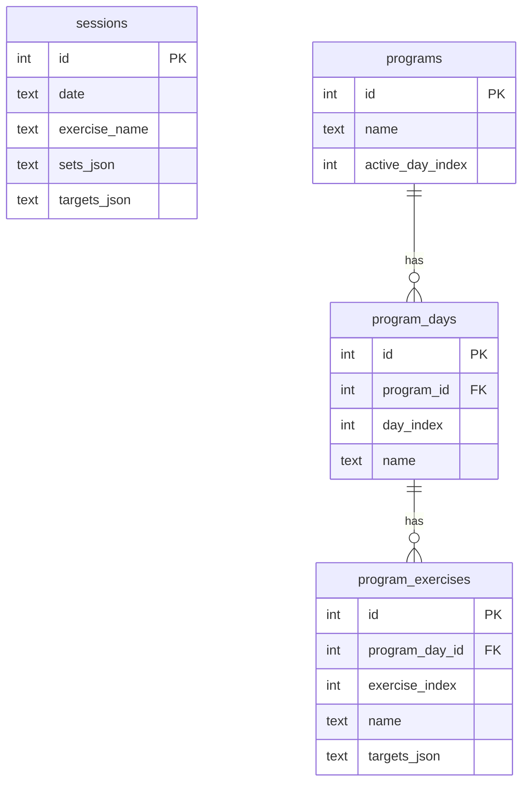

# Data model

> **State:** current as of v0.2 — all four tables exist in the schema.

## Tables

## Notes

**Sessions and programs are separate domains.** `program_exercises.exercise_name` and `sessions.exercise_name` are matched by string — there is no foreign key. Sessions are immutable historical facts; programs are plans. A program change or deletion must not touch history.

**Exercise name is the join key.** Keeping names consistent on import is load-bearing — if the same exercise appears as "Lunge, Dumbbell" in one domain and "Dumbbell Lunge" in the other, history and program silently decouple.

**Same exercise across days.** If an exercise appears on multiple program days (e.g. Squat on Day 1 and Day 3), `program_exercises` currently has independent rows for each. Progression state will likely need to key on `exercise_name` rather than `program_exercise_id` so both days advance together — to be resolved when the progression engine is built (v0.3).

**`sets_json` / `targets_json`** store arrays of `WorkingSet` / `Target` objects (see `src/types.ts`). Kept as JSON blobs to avoid a join-heavy schema while the shape is still evolving.

**Day-centric by design.** `program_days` has no week or block concept — just named days in order. This keeps the schema simple and accommodates programs from other sources that may not have a week structure.
