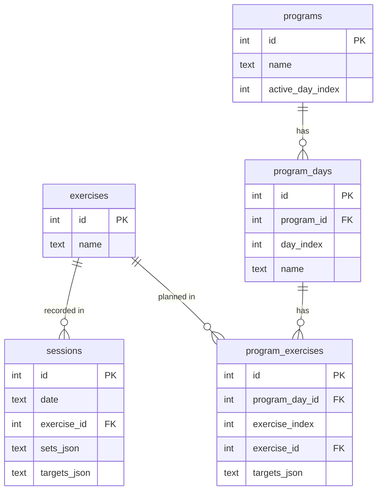

# Data model

> **State:** current as of v0.3 — five tables; exercises is the canonical name registry.

## Tables

## Notes

**`exercises` is the canonical name registry.** Both `sessions` and `program_exercises` reference `exercises.id` via foreign key instead of storing a name string. This ensures a single source of truth for exercise identity and makes renaming an exercise possible without rewriting history.

**Sessions and programs are still separate domains.** Sessions are immutable historical facts; programs are plans. A program change or deletion must not touch session rows. The shared FK into `exercises` is a naming contract, not a behavioural coupling.

**Same exercise across days.** If an exercise appears on multiple program days (e.g. Squat on Day 1 and Day 3), `program_exercises` has independent rows for each. Progression state will key on `exercise_id` so both days advance together — to be resolved when the progression engine is built.

**`sets_json` / `targets_json`** store arrays of `WorkingSet` / `Target` objects (see `src/types.ts`). Kept as JSON blobs to avoid a join-heavy schema while the shape is still evolving.

**Day-centric by design.** `program_days` has no week or block concept — just named days in order. This keeps the schema simple and accommodates programs from other sources that may not have a week structure.
